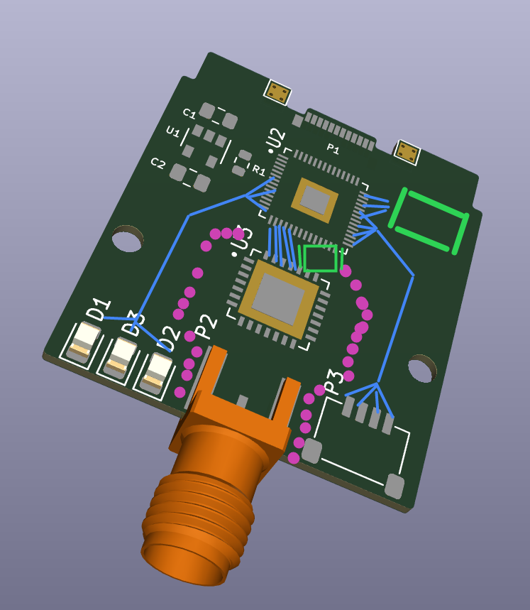

2022 Dec 17
Upon further review
- RP2040 is be overkill on #/GPIO, while lacking onboard memory. Consider other MCUs?
- RP2040 requires clock between 1 and 15 MHz to drive system. SX1231 requires between 26 and 32 MHz. The latter can be generated by the 2040, but is this the best call?
    - External oscillator driving both at 32 MHz, or RF IC and a different MCU, could be easier
        - RP-2040 clock outputs are disabled in DORMANT mode (see docs, 2.16.5). Depending on internal or external oscillator, can have lower start-up time or better frequency.
        - I think I want an external oscillator to have good RF clocking, but may consider an MCU with a different bus speed.
    - Upon doing more research, I think [I am sticking with the RP2040](https://www.reddit.com/r/AskElectronics/comments/u99eqn/how_is_the_rp2040_so_cheap/).
- [SMD battery](https://hackaday.com/2019/01/16/new-part-day-smd-batteries/) for RTC
    - Note comments from Tom and SlurmMcKenzie about charging
    - Note, max oscillator speed is 65.536 KHz, so this won't work
    - Also, even in dormant mode the RP-2040 still draws 0.18mA, so that battery can't power it at all
- SMA connectors are actually too large for this application
    - MMCX connectors are kinda rare (on digikey: antennas over $25, edge mounts over $6, low stock)
        - but there is decently prized stock on amazon ($2.65per, for 4-packs)
        - but yet again, antennas are $33 on mouser, $29 on DigiKey
    - Could try chip/module antennas, but these need grounding planes and lots of length
        - Ex: (ANT-916-USP](https://www.digikey.com/en/products/detail/linx-technologies-inc/ANT-916-USP/3830737)
    - Could try wire antennas
        - This is probably best for the prototype
    - Could try strip antennas
        - Hardest to calculate
    - [List of 915 MHz antenna patterns](https://www.ead-ltd.com/news/using-915-mhz-antennas-lora-communications-food-thought)

---
2022 Dec 16

FrameWork LoRa Expansion Card Design Document

Onboard features
- Exposed SWD pads (3x)
- Exposed debug thru-holes (3x) w square pads, for debugging
- Moderate flash memory (say, 8gb) - allows larger programs to run
- Oscillator
    - Built-in RP2040 oscillator is kinda.. bad
    - Should be able to drive both MCU and RF IC, if possible
- Bootsel triggered via software only

Peripherals
1. 900 MHz antenna
    - For communications
2. LEDx3
    - One indicator each for the RP-2040 core, LoRa transmitter, and sensor port.
3. Female Qwiic Connector
    - I2C or SPIO bus
    - https://www.adafruit.com/product/4208

Additional major features I'd like to have are...
- An onboard chip or trace antenna
    - This could be very important for convenience, durability
- An SD card reader
    - Accessible from above?
- A coin cell battery
- RTC
